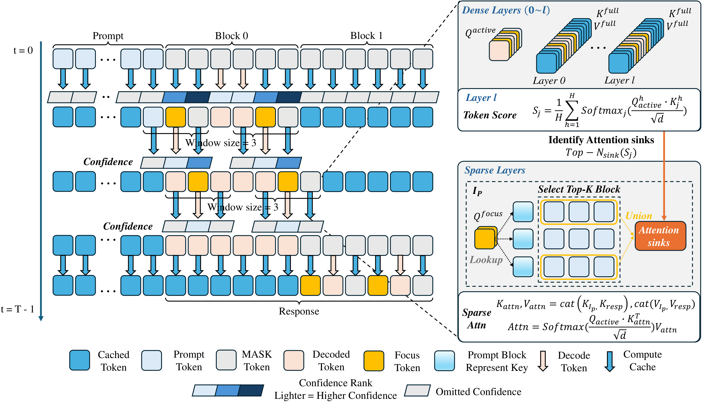
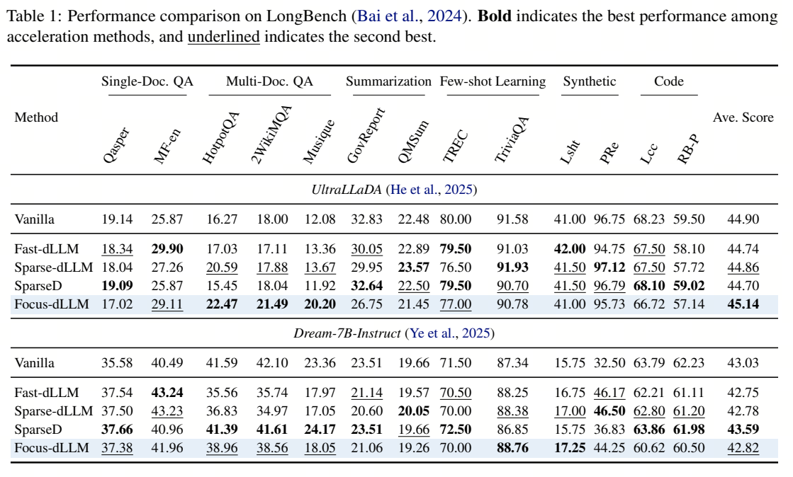
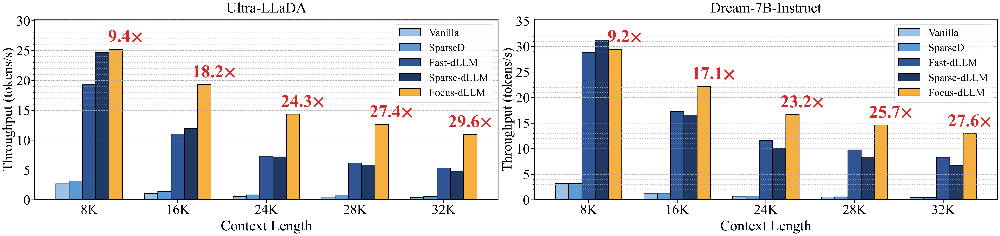

# Focus-dLLM: Accelerating Long-Context Diffusion LLM Inference via Confidence-Guided Context Focusing

Lingkun Long1, Yushi Huang2,3, Shihao Bai3, Ruihao Gong1,3, Jun Zhang2, Ao Zhou1, Jianlei Yang1,*

1 Beihang University, 2 Hong Kong University of Science and Technology, 3 SenseTime Research

[📝 Paper] | [<a href="https://github.com/Longxmas/Focus-dLLM">🚀 Code</a>]

---

## 📢 News
- **(02/2025)** **Focus-dLLM** is officially presented. The core implementation and framework details will be released in this repository.
- **Supported Models**: LLaDA-8B, UltraLLaDA, Dream-7B.

---

## 📖 Introduction

**Focus-dLLM** is a **training-free attention sparsification framework** tailored for accurate and efficient long-context inference in **Diffusion Large Language Models (dLLMs)**.

While dLLMs introduce a compelling non-autoregressive paradigm via iterative denoising, the considerable computational cost of bidirectional full attention limits their inference efficiency. Existing sparse attention methods remain ineffective for dLLMs because they require estimating attention importance for tokens yet to be decoded, while the unmasked token positions are unknown during the diffusion process.

To address this, Focus-dLLM introduces a novel pipeline that accurately predicts unmasked regions and retains only necessary computation. Our approach delivers more than **29× lossless speedup** under 32K context length, offering a superior Pareto frontier between throughput and generation quality.

  
   
  <em>Figure 1: Overview of Focus-dLLM. We employ a past confidence-guided indicator to predict unmasked positions and leverage a sink-aware pruning strategy to dynamically identify and reuse attention sinks.</em>

---

## 🛠️ Core Techniques

### 1. Past Confidence-Guided Indicator
We discover that token confidence exhibits a strong positive correlation across adjacent denoising steps. Based on this, we design an indicator that uses **confidence scores from step $t-1$** to accurately predict the unmasked positions at step $t$. We further apply window expansion to these predicted positions to preserve local semantic coherence, forming a focused query set for attention computation.

### 2. Sink-Aware Sparse Attention
To eliminate redundant computation, we propose a **sink-aware pruning strategy**. This mechanism:
* **Dynamic Attention Sink Identification:** Explicitly identifies and retains attention sinks to preserve generation quality.
* **Cross-Layer Consistency:** Leverages the observation that attention sinks match across layers. We identify sinks at an intermediate layer and reuse their locations for subsequent sparse layers, avoiding repeated re-identification overhead.
* **Block-wise Pruning:** Applies dynamic pruning to Key/Value states of the prompt tokens to keep the most relevant history while retaining all response tokens.

---

## 🚀 Key Results

### Accuracy
Focus-dLLM achieves robust performance across LongBench. On UltraLLaDA, our method achieves the highest average score, outperforming vanilla baselines and existing acceleration frameworks.

  

### Efficiency
Focus-dLLM demonstrates superior scalability. As context length grows, the speedup ratio expands significantly, reaching **29.6×** at 32K context.

  

---

## 🗒️ To-Do List
- [ ] Refactor and release the official implementation code.
- [ ] Support more dLLM architectures.

---

## 🤓 Acknowledgement

Our framework is built upon the open-source project **[Fast-dLLM](https://github.com/NVlabs/Fast-dLLM)**.  We also incorporate ideas and implementation details inspired by several pioneering works in the dLLM and sparse attention community:
- **[Sparse-dLLM](https://github.com/OpenMOSS/Sparse-dLLM)**
- **[SparseD](https://github.com/INV-WZQ/SparseD)**

Furthermore, our experiments leverage diffusion language models from:
- **[UltraLLaDA](https://github.com/Relaxed-System-Lab/UltraLLaDA)**
- **[LLaDA](https://github.com/ML-GSAI/LLaDA)**
- **[Dream-7B](https://github.com/DreamLM/Dream)**

We sincerely thank the authors for their open-source contributions, which greatly facilitated the development of **Focus-dLLM**.